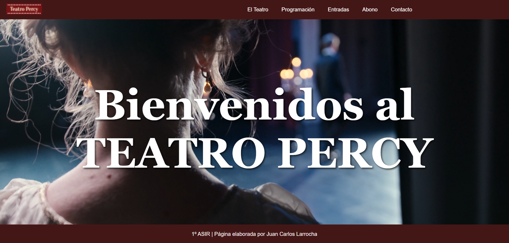

# Proyecto Teatro Percy

## Descripción del Proyecto
Este repositorio contiene los archivos de nuestro proyecto web para el **Teatro Percy**, desarrollado por **Juan Carlos y Percival**.
El sitio web incluye varias páginas en HTML y recursos relacionados, que ofrecen información sobre el teatro, su programación y servicios.

## Estructura del Proyecto
El proyecto está compuesto por las siguientes páginas y elementos:

| Página                 | Descripción                                                                 |
|:------------------------:|:-----------------------------------------------------------------------------:|
| **juancarlos-index.html** | Página principal con el video de presentación del teatro.                    |
| **juancarlos-programacion.html** | Información de los espectáculos y próximas funciones.                 |
| **juancarlos-abonados.html**    | Registro de abonados mediante un formulario.                           |
| **percy-contacto.html**    | Información de contacto del teatro.                                         |
| **percy-elteatro.html**    | Historia y ubicación del teatro.                                            |
| **percy-entradas.html**    | Compra de entradas de las distintas funciones                               |

Además, se incluyen carpetas y archivos relacionados como estilos CSS, imágenes y videos.

## Recursos
### Captura de Pantalla
A continuación, se adjunta una captura de pantalla de la página principal:

### Navegación
La web cuenta con un panel de navegación que incluye enlaces a las diferentes páginas:
- [El Teatro](./grupo3_ProyectoCSS/percy-elteatro.html)
- [Programación](./grupo3_ProyectoCSS/juancarlos-programacion.html)
- [Entradas](./grupo3_ProyectoCSS/percy-entradas.html)
- [Abono](./grupo3_ProyectoCSS/juancarlos-abonados.html)
- [Contacto](./grupo3_ProyectoCSS/percy-contacto.html)

### Tabla de Programación
En la página de programación, se incluye el horario :

| Fecha          | Espectáculo         | Hora   | Precio |
|----------------|---------------------|--------|--------|
| 1 de diciembre | Rostros ocultos     | 20:00  | 15€    |
| 3 de diciembre | Al ritmo de la vida | 18:00  | 20€    |
| 5 de diciembre | Cuando el alma llora | 21:00  | 12€    |
| 17 de diciembre | Café para dos      | 17:00  | 10€    |